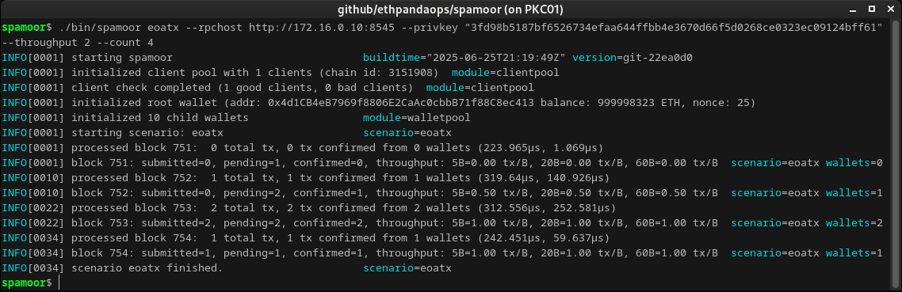
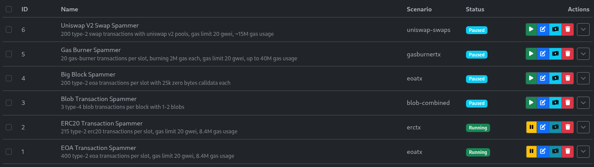
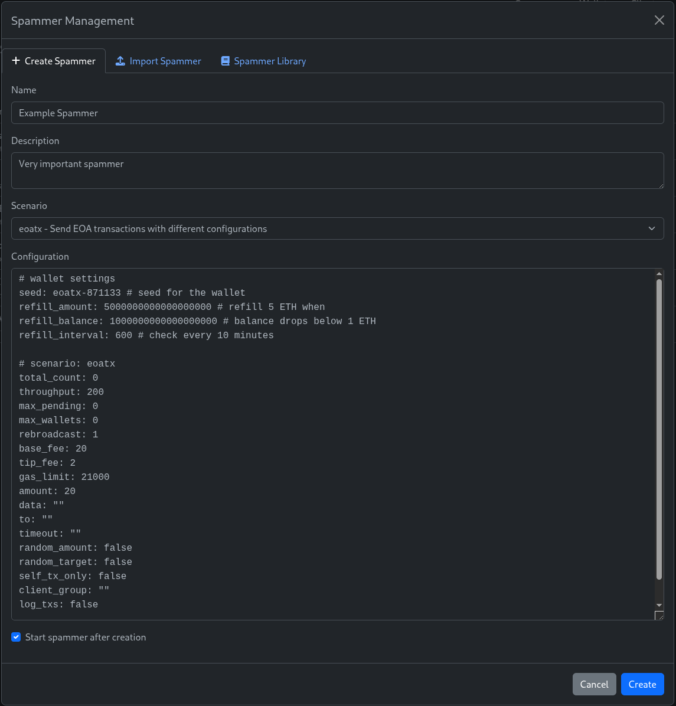
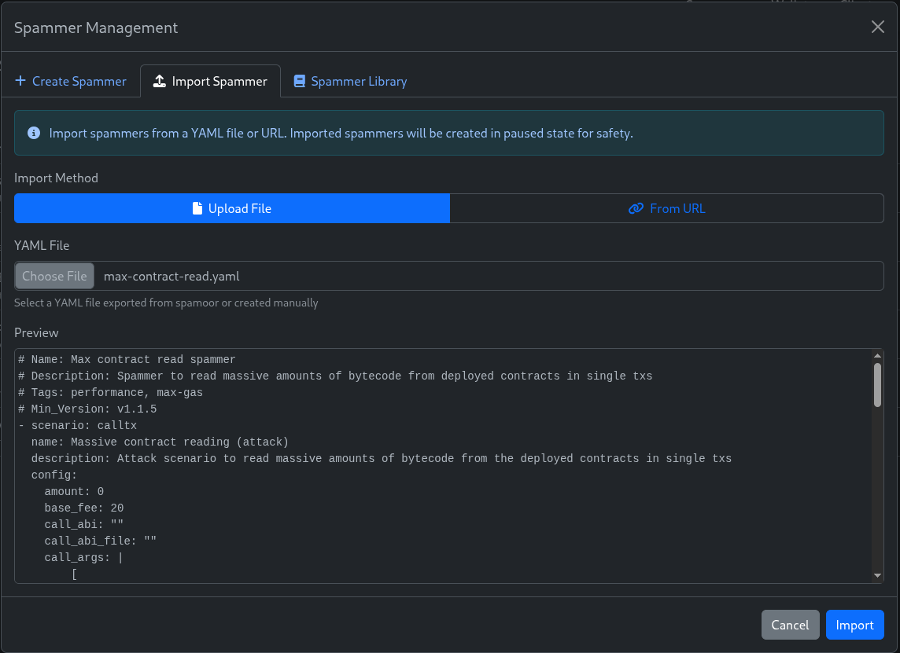
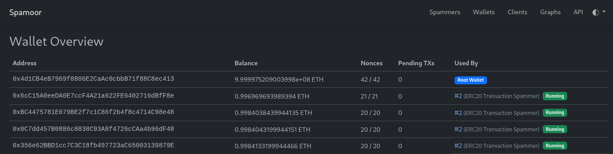
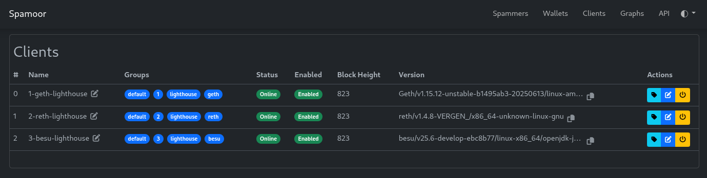
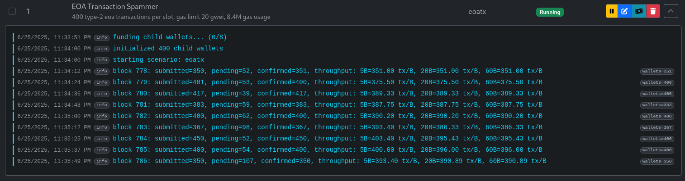

# Spamoor App User Guide

Spamoor is a powerful Ethereum transaction spamming tool designed for testing and stress-testing Ethereum networks. This guide covers how to use Spamoor as an end user, both as a CLI utility and through the web-based daemon interface.

## Table of Contents

- [Prerequisites](#prerequisites)
- [Installation](#installation)
- [Quick Start](#quick-start)
- [CLI Usage](#cli-usage)
- [Daemon Mode](#daemon-mode)
- [Available Scenarios](#available-scenarios)
- [Configuration](#configuration)
- [Examples](#examples)
- [Troubleshooting](#troubleshooting)

## Prerequisites

Before using Spamoor, you need:

1. **Prefunded Root Private Key**: A private key with sufficient ETH to fund child wallets and pay for transaction fees
2. **Execution Layer RPC Endpoints**: At least one Ethereum RPC endpoint to send transactions to
3. **System Requirements**: 
   - Go 1.25+ (if building from source)
   - Docker (for containerized deployment)

## Installation

### Option 1: Using Docker (Recommended)

Pull the latest Docker image:
```bash
docker pull ethpandaops/spamoor:latest
```

### Option 2: Using Pre-built Releases

Download the latest release from the [GitHub releases page](https://github.com/ethpandaops/spamoor/releases).

### Option 3: Building from Source

```bash
git clone https://github.com/ethpandaops/spamoor.git
cd spamoor
make build
```

The built binaries will be available in the `bin/` directory.

## Quick Start

### CLI Output Example

*Spamoor CLI showing transaction progress and statistics*

### CLI Mode - Send 100 EOA Transactions

```bash
# Using binary
./spamoor eoatx \
  --privkey "0x1234567890abcdef..." \
  --rpchost "http://localhost:8545" \
  --count 100

# Using Docker
docker run --rm ethpandaops/spamoor eoatx \
  --privkey "0x1234567890abcdef..." \
  --rpchost "http://localhost:8545" \
  --count 100
```

### Daemon Mode - Web Interface

```bash
# Using binary
./spamoor-daemon \
  --privkey "0x1234567890abcdef..." \
  --rpchost "http://localhost:8545" \
  --port 8080

# Using Docker
docker run -p 8080:8080 --entrypoint ./spamoor-daemon ethpandaops/spamoor \
  --privkey "0x1234567890abcdef..." \
  --rpchost "http://localhost:8545" \
  --port 8080
```

Then open http://localhost:8080 in your browser.

## CLI Usage

### Basic Command Structure

```bash
# Run a single scenario
spamoor [scenario] [flags]

# Run multiple scenarios from YAML configuration
spamoor run [yaml-file] [flags]
```

### Global Flags

| Flag | Description | Default |
|------|-------------|---------|
| `--privkey`, `-p` | Private key of the root wallet | Required |
| `--rpchost`, `-h` | RPC endpoint(s) to send transactions to | Required |
| `--rpchost-file` | File containing list of RPC hosts | |
| `--seed`, `-s` | Seed for deterministic child wallet generation | |
| `--refill-amount` | ETH amount to fund each child wallet | 5 |
| `--refill-balance` | Minimum ETH balance before refilling | 2 |
| `--refill-interval` | Interval for balance checks (seconds) | 300 |
| `--verbose`, `-v` | Enable verbose logging | false |
| `--trace` | Enable trace logging | false |

### RPC Host Configuration

You can specify RPC hosts in multiple ways:

1. **Single host**: `--rpchost http://localhost:8545`
2. **Multiple hosts**: `--rpchost http://host1:8545 --rpchost http://host2:8545`
3. **Comma-separated**: `--rpchost http://host1:8545,http://host2:8545`
4. **From file**: `--rpchost-file hosts.txt`

Example `hosts.txt` file:
```
http://host1:8545
http://host2:8545
```

### Wallet Management

Spamoor uses a sophisticated wallet management system designed for isolation, automation, and high-throughput operations:

#### Wallet Architecture

- **Root Wallet**: Your funded wallet specified by `--privkey` (never used directly for transactions)
- **Scenario Wallets**: Each scenario gets its own unique set of wallets derived from root + scenario seed
- **Numbered Wallets**: Pool of wallets for mass transaction operations (accessed by index)
- **Named Wallets**: Special-purpose wallets for deployments, admin roles, etc. (accessed by name)

#### Automatic Management

The tool automatically handles all wallet operations:

- **Derivation**: Generates deterministic wallets using root private key + scenario seed
- **Funding**: Continuously monitors and refills wallets when balances drop below thresholds
- **Distribution**: Spreads transactions across multiple wallets to respect client limits
- **Isolation**: Each scenario's wallets are completely separate from other scenarios
- **Recovery**: Can reclaim leftover funds back to root wallet after execution

#### Key Benefits

- **High Throughput**: Multiple wallets bypass per-sender transaction limits (64-1000 pending tx per wallet)
- **Scenario Isolation**: No wallet conflicts between different running scenarios
- **Deterministic**: Same scenario always uses same wallet addresses for reproducible testing
- **Automated**: No manual wallet management required - funding and distribution handled automatically

## Run Command - Execute Multiple Scenarios

The `spamoor run` command allows you to execute multiple scenarios concurrently from a YAML configuration file, providing a lightweight alternative to daemon mode.

### Command Structure

```bash
spamoor run <yaml-file> [flags]
```

### Run Command Flags

| Flag | Description | Default |
|------|-------------|---------|
| `--spammers`, `-s` | Indexes of spammers to run (e.g., `-s 0,2,3`) | All |
| `--privkey`, `-p` | Private key of the root wallet | Required |
| `--rpchost`, `-h` | RPC endpoint(s) to send transactions to | Required |
| `--rpchost-file` | File containing list of RPC hosts | |
| `--verbose`, `-v` | Enable verbose logging | false |
| `--trace` | Enable trace logging | false |

### Configuration File Format

The YAML configuration file uses the same format as daemon import/export:

```yaml
# example-config.yaml
- scenario: eoatx
  name: "High Volume ETH Transfers"
  description: "Basic ETH transfers with 400 tx/slot throughput"
  config:
    seed: eoatx-demo
    refill_amount: 1000000000000000000  # 1 ETH in wei
    refill_balance: 500000000000000000  # 0.5 ETH threshold
    refill_interval: 600  # 10 minutes
    throughput: 400       # transactions per slot
    max_pending: 800      # max pending transactions
    max_wallets: 200      # number of wallets to use
    base_fee: 20          # base fee in gwei
    tip_fee: 2            # priority fee in gwei
    amount: 100           # transfer amount in wei
    random_amount: true   # randomize transfer amounts
    random_target: true   # randomize target addresses

- scenario: erctx
  name: "ERC20 Token Spammer"
  description: "Deploy ERC20 contracts and transfer tokens"
  config:
    seed: erctx-demo
    refill_amount: 2000000000000000000  # 2 ETH
    refill_balance: 1000000000000000000 # 1 ETH threshold
    throughput: 100       # lower throughput for contract interactions
    max_pending: 200
    max_wallets: 100
    amount: 50            # token transfer amount
    random_amount: true
    random_target: true
    
- scenario: blob-combined
  name: "Blob Transaction Test"
  description: "Mixed blob transaction scenarios"
  config:
    seed: blob-demo
    refill_amount: 5000000000000000000  # 5 ETH (blob txs are expensive)
    refill_balance: 2000000000000000000 # 2 ETH threshold
    throughput: 3         # low throughput for blob transactions
    sidecars: 2          # number of blob sidecars
    max_pending: 6       # low pending limit
    max_wallets: 10      # fewer wallets needed
    blob_fee: 20         # blob base fee in gwei

- scenario: gasburnertx
  name: "Gas Burner Test"
  description: "Burn gas to test block limits"
  config:
    seed: gasburn-demo
    refill_amount: 3000000000000000000  # 3 ETH
    refill_balance: 1000000000000000000 # 1 ETH threshold
    throughput: 5
    max_pending: 10
    max_wallets: 20
    gas_units_to_burn: 500000  # gas to burn per transaction
    gas_remainder: 50000       # remaining gas after burn
```

### Including Other Configuration Files

You can split configurations across multiple files using includes:

```yaml
# main-config.yaml
- scenario: eoa-transfer
  name: "ETH Transfers"
  config:
    wallet_count: 50

# Include additional configurations
- include: ./erc20-spammers.yaml
- include: ./blob-spammers.yaml
- include: https://example.com/remote-config.yaml
```

### Examples

```bash
# Run all spammers from configuration
spamoor run config.yaml -h http://localhost:8545 -p 0x...

# Run specific spammers by index (0-based)
spamoor run config.yaml -h http://localhost:8545 -p 0x... -s 0,2

# Run first and third spammer only
spamoor run config.yaml -p 0x... -h http://localhost:8545 --spammers 0,2

# With verbose output
spamoor run config.yaml -p 0x... -h http://localhost:8545 -v

# Using multiple RPC endpoints
spamoor run config.yaml -p 0x... \
  -h http://node1:8545 \
  -h http://node2:8545 \
  -h http://node3:8545
```

### Run Command vs Daemon Mode

**Use `spamoor run` when you need:**
- Quick execution of predefined scenarios
- No web interface or API required
- Lightweight deployment (no database)
- Simple concurrent scenario execution
- CI/CD integration

**Use daemon mode when you need:**
- Web interface for monitoring
- Dynamic spammer management
- Persistent configuration storage
- REST API access
- Real-time metrics and log visualization

## Daemon Mode

The daemon mode provides a web-based interface for managing multiple concurrent spammers.


*The Spamoor dashboard showing multiple active spammers with their status and controls*

### Starting the Daemon

```bash
spamoor-daemon \
  --privkey "0x1234567890abcdef..." \
  --rpchost "http://localhost:8545" \
  --port 8080 \
  --db spamoor.db
```

### Daemon-Specific Flags

| Flag | Description | Default |
|------|-------------|---------|
| `--port`, `-P` | Web interface port | 8080 |
| `--db`, `-d` | SQLite database file | spamoor.db |
| `--startup-spammer` | YAML file with startup spammer configurations | |
| `--startup-delay` | Delay in seconds before starting spammers on startup | 30 |
| `--without-batcher` | Disable transaction batching | false |
| `--debug` | Enable debug mode | false |

### Web Interface Features

Once the daemon is running, access the web interface at `http://localhost:8080`:

#### Dashboard - Spammer Management

*Main dashboard with spammer list, status indicators, and control buttons*

**Key Features:**
- **Spammer Overview**: View all spammers with their ID, name, scenario type, and current status
- **Quick Actions**: Start, stop, edit, and delete spammers with one click
- **Live Logs**: Expand any spammer to view real-time log output
- **Mass Actions**: Select multiple spammers for bulk operations

#### Creating New Spammers

*Create new spammer dialog with scenario selection and configuration editor*

**Features:**
- **Scenario Selection**: Choose from 13+ pre-configured scenarios
- **YAML Configuration**: Edit configuration with syntax highlighting
- **Library Access**: Browse and use pre-built configurations
- **Validation**: Real-time configuration validation

#### Import Spammers

*Import spammers from YAML files or URLs*


*Browse pre-built spammer configurations from the library*

#### Wallet Management

*Wallet management page showing balances and transaction counts*

**Monitor:**
- Root wallet balance and transactions
- Child wallet status and funding
- Real-time balance updates

#### Client Pool Management

*RPC client management with grouping and status monitoring*

**Capabilities:**
- View all RPC endpoints and their status
- Group clients for load balancing
- Enable/disable clients dynamically
- Monitor block height and client versions

#### Performance Graphs

*Real-time performance metrics and transaction statistics*

**Visualizations:**
- Transaction throughput over time
- Success/failure rates per spammer
- Gas usage statistics
- Network performance metrics

### Creating Spammers via Web Interface


1. **Navigate to the dashboard** - Click the "Create Spammer" button
2. **Select a scenario** - Choose from available transaction types
3. **Configure parameters**:
   - Set transaction count or throughput
   - Configure gas settings (base fee, tip fee)
   - Adjust scenario-specific options
4. **Use the library** - Browse pre-built configurations for common test cases
5. **Validate configuration** - Ensure YAML syntax is correct
6. **Create and start** - Add the spammer and begin transaction generation

#### Live Log Viewing

*Expanded log view showing real-time transaction status and debugging information*

### Startup Spammers

You can configure spammers to start automatically using a YAML configuration file:

```yaml
# startup-spammers.yaml
- scenario: eoatx
  config:
    throughput: 10
    amount: 100
    random_amount: true

- scenario: blobs
  config:
    throughput: 5
    sidecars: 3
```

Start daemon with startup spammers:
```bash
spamoor-daemon \
  --privkey "0x1234567890abcdef..." \
  --rpchost "http://localhost:8545" \
  --startup-spammer startup-spammers.yaml
```

#### Startup Delay Protection

To prevent crash loops from problematic configurations, spammers automatically restored from the database or loaded from startup configurations are subject to a startup delay:

- **Default Delay**: 30 seconds (configurable with `--startup-delay`)
- **Purpose**: Allows time to review and cancel potentially problematic spammers
- **Behavior**: Spammers appear as "Running" but wait before executing scenarios
- **UI Indicator**: Warning banner shows countdown timer during active delay
- **User Control**: Spammers can be paused during delay to prevent execution

This safety feature is especially useful in production environments where daemon restarts should not immediately trigger problematic transaction patterns.

## Available Scenarios

Spamoor supports multiple transaction scenarios for different testing needs. For a complete list of available scenarios with detailed descriptions and links to their documentation, see the [main README](../README.md#-transaction-scenarios).

### Common Scenario Flags

Most scenarios support these common flags:

| Flag | Description |
|------|-------------|
| `--count`, `-c` | Total number of transactions to send |
| `--throughput`, `-t` | Transactions per slot (continuous mode) |
| `--max-pending` | Maximum pending transactions |
| `--basefee` | Max fee per gas (gwei) |
| `--tipfee` | Max tip per gas (gwei) |
| `--gaslimit` | Gas limit per transaction |
| `--max-wallets` | Maximum child wallets to use |

## Common Configuration

### Transaction Fees

Configure gas pricing:
```bash
spamoor eoatx \
  --basefee 30 \      # Max fee per gas (gwei)
  --tipfee 5 \        # Max tip per gas (gwei)
  --gaslimit 21000   # Gas limit
```

### Throughput Control

Two modes for controlling transaction volume:

1. **Fixed Count**: Send exactly N transactions
```bash
spamoor eoatx --count 1000
```

2. **Continuous Throughput**: Send N transactions per slot indefinitely
```bash
spamoor eoatx --throughput 10
```

### Concurrency Management

Control transaction concurrency:
```bash
spamoor eoatx \
  --throughput 10 \
  --max-pending 50 \    # Max unconfirmed transactions
  --max-wallets 20      # Max concurrent wallets
```

## Examples

### Example 1: Basic EOA Transactions

Send 500 EOA transactions with random amounts:
```bash
spamoor eoatx \
  --privkey "0x1234567890abcdef..." \
  --rpchost "http://localhost:8545" \
  --count 500 \
  --amount 100 \
  --random-amount \
  --verbose
```

**Expected Output:**
```
INFO[2025-06-25T10:30:45] Initialized scenario: eoatx
INFO[2025-06-25T10:30:45] Starting transaction spammer
INFO[2025-06-25T10:30:45] Creating 10 child wallets...
INFO[2025-06-25T10:30:46] Funding child wallets...
INFO[2025-06-25T10:30:47] Starting transaction generation
INFO[2025-06-25T10:30:48] Progress: 50/500 transactions (10.0%)
INFO[2025-06-25T10:30:49] Progress: 100/500 transactions (20.0%)
INFO[2025-06-25T10:30:50] Transaction confirmed: 0x1234... (gas: 21000)
...
INFO[2025-06-25T10:35:23] Completed: 500/500 transactions
INFO[2025-06-25T10:35:23] Success rate: 98.4% (492/500)
INFO[2025-06-25T10:35:23] Average gas used: 21000
INFO[2025-06-25T10:35:23] Total ETH spent: 0.2205 ETH
```

### Example 2: Continuous Blob Transactions

Send 5 blob transactions per slot continuously:
```bash
spamoor blobs \
  --privkey "0x1234567890abcdef..." \
  --rpchost "http://localhost:8545" \
  --throughput 5 \
  --sidecars 4 \
  --blobfee 50
```

**Expected Output:**
```
INFO[2025-06-25T10:40:12] Initialized scenario: blobs
INFO[2025-06-25T10:40:12] Configuration: 4 blobs per transaction
INFO[2025-06-25T10:40:12] Target throughput: 5 tx/slot
INFO[2025-06-25T10:40:13] Creating child wallets...
INFO[2025-06-25T10:40:14] Starting continuous blob generation
INFO[2025-06-25T10:40:15] Slot 1234: Sent 5 blob transactions
INFO[2025-06-25T10:40:27] Slot 1235: Sent 5 blob transactions
INFO[2025-06-25T10:40:28] Blob tx confirmed: 0xabcd... (blobs: 4, gas: 85000)
INFO[2025-06-25T10:40:39] Slot 1236: Sent 5 blob transactions
INFO[2025-06-25T10:40:40] Stats - Success: 15/15 (100%), Avg blob fee: 45 gwei
^C
INFO[2025-06-25T10:41:23] Shutting down gracefully...
INFO[2025-06-25T10:41:23] Final stats: 85 transactions, 340 blobs sent
```

### Example 3: Contract Deployments with Multiple RPC Hosts

Deploy contracts using multiple RPC endpoints with bytecode:
```bash
# Deploy simple storage contracts (stores a uint256 value)
spamoor deploytx \
  --privkey "0x1234567890abcdef..." \
  --rpchost "http://host1:8545,http://host2:8545" \
  --count 100 \
  --basefee 50 \
  --max-wallets 10 \
  --bytecodes "0x608060405234801561001057600080fd5b50600080819055506101ac806100276000396000f3fe608060405234801561001057600080fd5b50600436106100415760003560e01c80632e64cec11461004657806360fe47b1146100645780636057361d14610080575b600080fd5b61004e61009c565b60405161005b919061013a565b60405180910390f35b61006c6100a5565b60405161007991906101125b60405180910390f35b61009a600480360381019061009591906100ef565b6100ab565b005b60008054905090565b60005481565b8060008190555050565b6000813590506100c481610165565b92915050565b6000602082840312156100dc57600080fd5b60006100ea848285016100b5565b91505092915050565b61010281610155565b82525050565b600060208201905061011d60008301846100f9565b92915050565b61012c81610155565b811461013757600080fd5b50565b600060208201905061014f60008301846100f9565b92915050565b6000819050919050565b61016e81610155565b811461017957600080fd5b5056fea264697066735822beefdeadbeef5634"

# Deploy from a file with multiple bytecodes
echo "0x608060405234801561001057600080fd5b50600080819055506101ac806100276000396000f3fe..." > contracts.txt
echo "0x6080604052348015600f57600080fd5b50603f80601d6000396000f3fe6080604052600080..." >> contracts.txt

spamoor deploytx \
  --privkey "0x1234567890abcdef..." \
  --rpchost "http://host1:8545,http://host2:8545" \
  --count 100 \
  --bytecodes-file contracts.txt
```

### Example 4: ERC-20 Token Transfers

Send ERC-20 transfers using automatically deployed token contract:
```bash
spamoor erctx \
  --privkey "0x1234567890abcdef..." \
  --rpchost "http://localhost:8545" \
  --throughput 8 \
  --amount 100 \
  --random-amount \
  --random-target
```

The `erctx` scenario automatically:
1. **Deploys an ERC-20 token contract** at startup
2. **Mints tokens** to sender wallets as needed
3. **Sends transfers** between wallets using the deployed contract

### Example 5: Docker with Custom Configuration

Using Docker with mounted configuration:
```bash
# Create hosts file
echo -e "http://localhost:8545\nhttp://localhost:8546" > hosts.txt

# Run with mounted file
docker run --rm \
  -v $(pwd)/hosts.txt:/app/hosts.txt \
  ethpandaops/spamoor eoatx \
  --privkey "0x1234567890abcdef..." \
  --rpchost-file /app/hosts.txt \
  --count 1000
```

### Example 6: Daemon with Startup Configuration

```bash
# Create startup configuration
cat > startup.yaml << EOF
- scenario: eoatx
  config:
    throughput: 10
    amount: 50
    random_amount: true

- scenario: blobs  
  config:
    throughput: 3
    sidecars: 2
EOF

# Start daemon with startup spammers
docker run -p 8080:8080 \
  -v $(pwd)/startup.yaml:/app/startup.yaml \
  --entrypoint ./spamoor-daemon ethpandaops/spamoor \
  --privkey "0x1234567890abcdef..." \
  --rpchost "http://localhost:8545" \
  --startup-spammer /app/startup.yaml
```

## Troubleshooting

### Common Issues

1. **"No client available" Error**
   - Check RPC endpoint connectivity
   - Verify RPC hosts are reachable
   - Try with `--verbose` for detailed logs

2. **"Failed to prepare wallets" Error**
   - Ensure root wallet has sufficient ETH
   - Check private key format
   - Verify network connectivity

3. **High Gas Prices/Failed Transactions**
   - Adjust `--basefee` and `--tipfee` values
   - Monitor network congestion
   - Reduce `--throughput` if network is congested

4. **Database Errors (Daemon Mode)**
   - Check file permissions on database location
   - Ensure sufficient disk space
   - Try removing existing database file

5. **Build Errors**
   - Ensure CGO build is available (needs proper c compiler)
   - Check Go version: requires 1.25+
   - Install required build tags: `make build` uses proper tags

### Debug Options

Enable detailed logging:
```bash
# Verbose logging
spamoor eoatx --verbose ...

# Trace logging (very detailed)
spamoor eoatx --trace ...

# Log all transactions
spamoor eoatx --log-txs ...
```

### Getting Help

- View available scenarios: `spamoor` (without arguments)
- Scenario-specific help: `spamoor [scenario] --help`
- Check version: `spamoor --version`
- Web API documentation: `http://localhost:8080/docs` (daemon mode)

### Performance Tips

1. **Optimize Throughput**:
   - Use multiple RPC endpoints for better distribution
   - Increase `--max-wallets` for higher concurrency
   - Adjust `--max-pending` based on network capacity

2. **Resource Management**:
   - Monitor system memory usage during long runs
   - Use `--refill-interval` to control wallet management overhead
   - Consider using Docker for resource isolation

3. **Network Considerations**:
   - Test with lower throughput first
   - Monitor RPC endpoint response times
   - Use local or dedicated RPC endpoints for best performance

## Development Environment

### Quick Start with DevNet

Spamoor includes a complete development environment using Kurtosis that spins up a full Ethereum testnet with multiple clients:

```bash
# Start a full Ethereum devnet and launch spamoor daemon
make devnet-run
```

This command will:
1. **Start Ethereum testnet**: Uses Kurtosis to launch Geth, Reth, and Lighthouse clients
2. **Deploy additional services**: Includes Dora explorer and Blockscout block explorer
3. **Generate configuration**: Creates RPC host list and chain configuration automatically
4. **Launch spamoor daemon**: Starts spamoor-daemon connected to the testnet
5. **Pre-fund accounts**: Uses a well-known private key with pre-funded accounts

### Accessing the DevNet

Once running, you can access:
- **Spamoor Web UI**: http://localhost:8080 - Main spamoor dashboard
- **Dora Explorer**: Available on auto-assigned port (check Kurtosis output)
- **Blockscout Explorer**: Available on auto-assigned port (check Kurtosis output)
- **RPC Endpoints**: Listed in `.hack/devnet/generated-hosts.txt`

### DevNet Configuration

The devnet uses:
- **Well-known private key**: `3fd98b5187bf6526734efaa644ffbb4e3670d66f5d0268ce0323ec09124bff61`
- **Multiple EL clients**: Geth and Reth for execution
- **CL client**: Lighthouse for consensus
- **High gas limits**: 100M gas limit for testing large transactions
- **Fast finality**: Electra fork enabled for quick testing

### Customizing DevNet

Create `.hack/devnet/custom-kurtosis.devnet.config.yaml` to override the default configuration:

```yaml
participants_matrix:
  el:
    - el_type: geth
    - el_type: reth
    - el_type: nethermind  # Add more clients
  cl:
    - cl_type: lighthouse
network_params:
  preset: mainnet
  gas_limit: 200000000     # Even higher gas limit
additional_services:
  - spamoor
  - dora
  - blockscout
```

### Cleaning Up

Stop and remove the entire devnet:

```bash
make devnet-clean
```

This removes all containers, networks, and generated files.

### Benefits for Testing

The DevNet environment provides:
- **Realistic multi-client setup**: Test against multiple Ethereum implementations
- **Fast block times**: Quick feedback for transaction testing
- **Pre-configured tools**: Block explorers and monitoring included
- **Isolated environment**: No impact on mainnet or public testnets
- **Reproducible setup**: Same configuration every time
- **Complete ecosystem**: Full Ethereum stack in one command

For additional support, check the [GitHub repository](https://github.com/ethpandaops/spamoor) or create an issue with detailed logs and configuration.